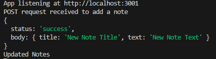

# Note Taker

## Description

This application is a Note Taker. It is used to write and save notes so that it can be viewed at a later date. The purpose of this project was to practice and use Express.js. The backend will save and  retrieve notes from a JSON file. 

## Usage

A link to the website: https://dmendoza013.github.io/note-taker/

## Screenshot 

## Credits

Starter Code was used for this project. Here is a link to it: https://github.com/coding-boot-camp/miniature-eureka